# 神经网络入门笔记

> 来源：闪客 B站视频合集笔记整理
> 核心理念：函数即变换，神经网络本质是用复杂非线性函数逼近任意连续关系

---

## 一、从函数到神经网络

### 1.1 符号主义与联结主义

早期人工智能采用**符号主义**——用精确函数表示一切关系。但现实世界中，很多关系无法精确描述，于是转向**联结主义**：用近似解逼近真实关系，函数不必精确穿过每个点。

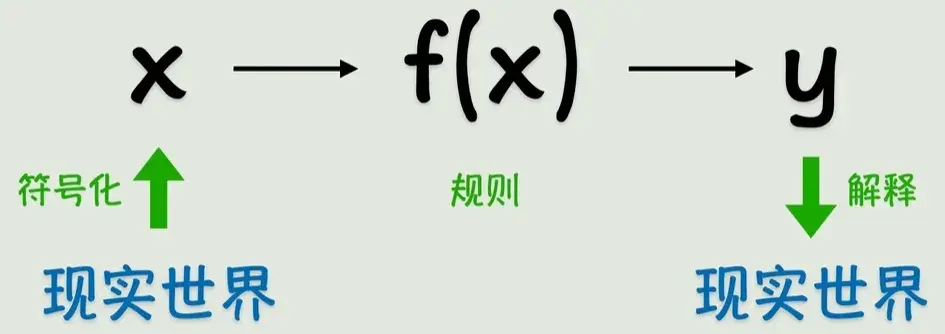

### 1.2 线性函数的局限

简单线性函数能拟合直线关系，但当数据呈现曲线时便失效了。

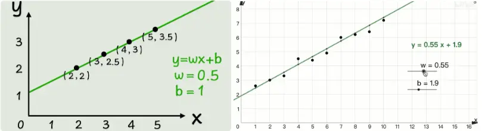

解决方法：套非线性函数（平方、正弦、指数等），这就是**激活函数**。

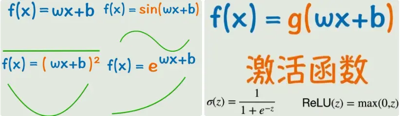

### 1.3 函数嵌套与神经元

单输入、单激活函数不够用 → 多输入、多层嵌套 → 形成复杂非线性函数，理论上可逼近任意连续函数。

引入**神经元**概念：图中的小圈即为神经元，多个神经元互联形成网状结构 → **神经网络**。

随着嵌套加深，原本的输出变成中间层 → **隐藏层**：位于输入层和输出层之间，负责特征提取和变换。

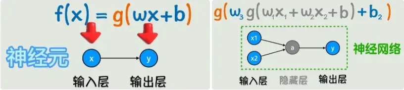

---

## 二、前向传播与训练原理

### 2.1 前向传播

信号从左向右传播的过程即**前向传播**。层数和神经元都可叠加，构造复杂非线性函数。

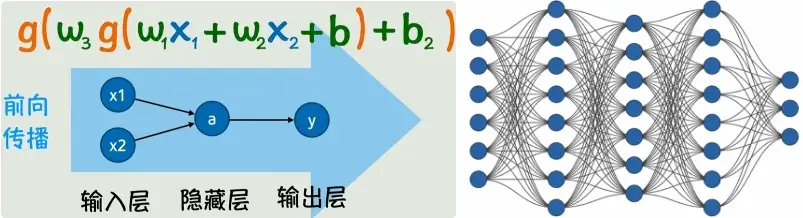

目标：根据已知 x、y，猜出所有 w 和 b。

### 2.2 损失函数

如何评估拟合效果？用预测值与真实值的误差表示。

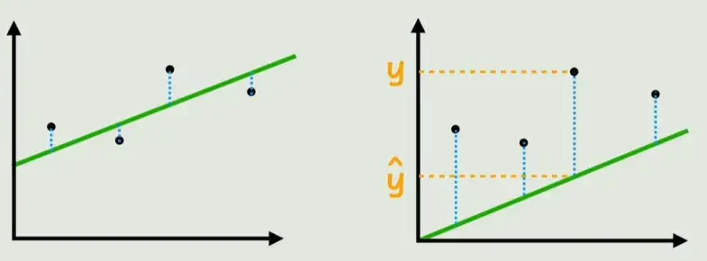

- 单点误差：|预测值 - 真实值|
- 整体误差：所有点误差之和 → **损失函数**（常用均方误差 MSE）

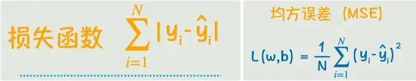

目标：找到让损失函数 L 最小的 w 和 b。

### 2.3 梯度下降

线性回归可用「令偏导数 = 0」求解。但神经网络损失函数复杂，采用**梯度下降**：

1. 调整参数，观察损失函数变化
2. 若 L 增大 → 反向调整
3. 变化速度 = 损失函数对参数的偏导数
4. **梯度**：所有偏导数构成的向量
5. **学习率**：控制变化步长的系数

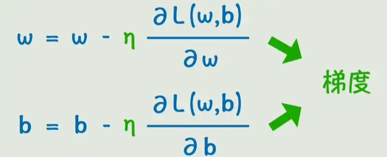

### 2.4 反向传播

求偏导数的关键方法。从右向左逐层计算偏导数，中间值可复用 → **反向传播**。

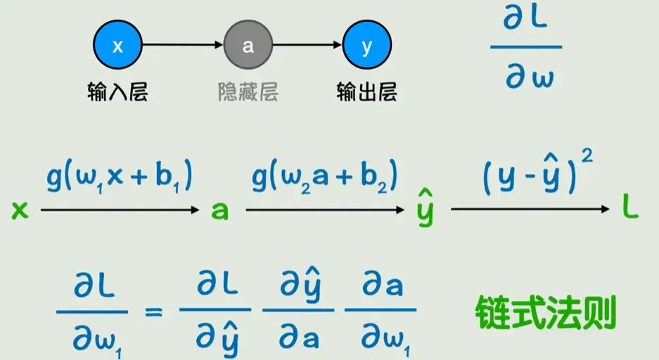

**训练流程小结**：
- 前向传播：x → y
- 反向传播：计算梯度
- 参数更新：向梯度反方向调整
- 多轮迭代 → 损失足够小 → 得到目标函数

---

## 三、过拟合与正则化

### 3.1 过拟合问题

模型太复杂，学到了噪声和随机波动 → 新数据预测能力差 → **泛化能力**不足。

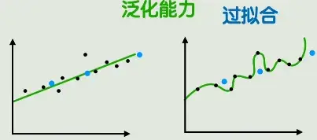

### 3.2 解决方案

| 方法 | 原理 |
|------|------|
| 简化模型 | 减少复杂度 |
| 增加数据 | 数据充足不易过拟合 |
| 数据增强 | 图像旋转、镜像、裁剪等 |
| 早停训练 | 发现过拟合趋势时停止 |
| **正则化** | 损失函数加惩罚项抑制参数增长 |
| Dropout | 训练时随机丢弃部分参数 |

### 3.3 正则化详解

在损失函数中添加惩罚项：
- L1 正则化：加上参数本身（绝对值）
- L2 正则化：加上参数平方和（大参数抑制更强）

**正则化系数**控制惩罚力度，属于**超参数**。

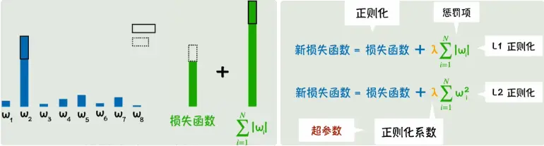

---

## 四、其他训练挑战

| 问题 | 解决方案 |
|------|----------|
| 梯度消失 | ReLU、批归一化、残差连接 |
| 梯度爆炸 | 梯度裁剪、权重初始化 |
| 局部最优 | 多次初始化、学习率调度 |
| 计算量大 | GPU 加速、分布式训练 |

---

## 五、矩阵表示与层结构

### 5.1 矩阵简化

复杂式子用矩阵表示更简洁，且 GPU 并行运算效率更高。

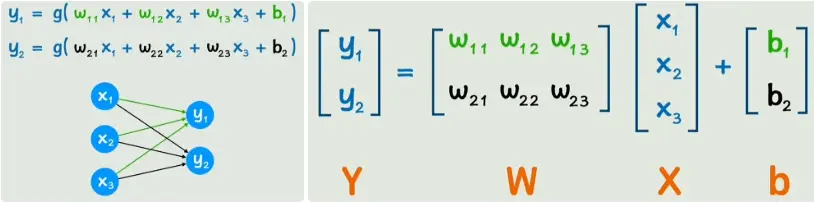

### 5.2 层表示

输入层 a[0]，隐藏层 a[1]、a[2]...，输出层 a[n]

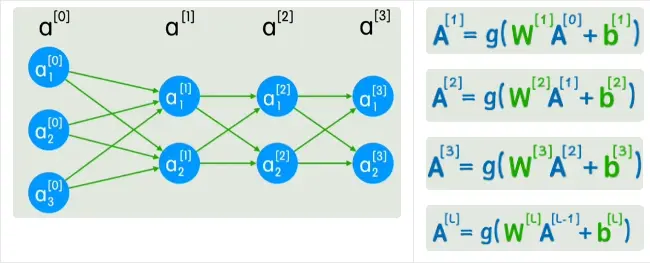

---

## 六、卷积神经网络 CNN

### 6.1 全连接层的局限

900像素输入 → 全连接层需90万参数，且丢失像素位置关系，图像平移后所有神经元都变化。

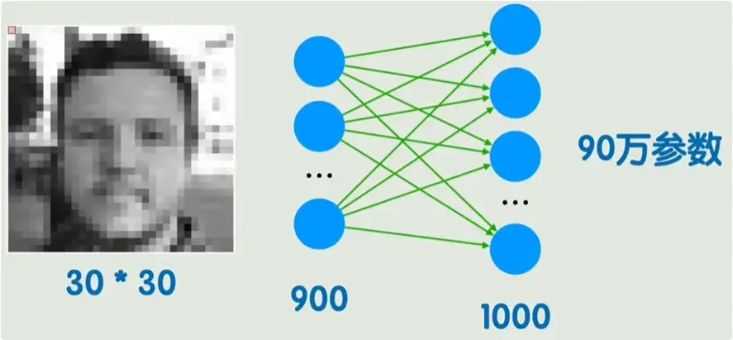

### 6.2 卷积运算

取 3×3 块，与**卷积核**对应位置相乘求和，遍历整图 → 形成新图像。

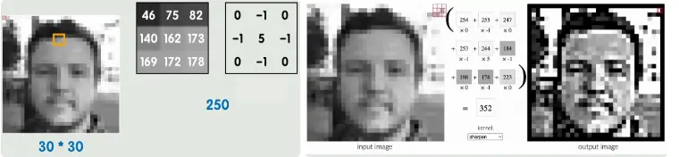

传统图像处理卷积核已知（轮廓、锐化、模糊），神经网络卷积核是参数，通过训练学习。

### 6.3 CNN 结构

全连接层 → 卷积层，减少参数，捕捉局部信息。

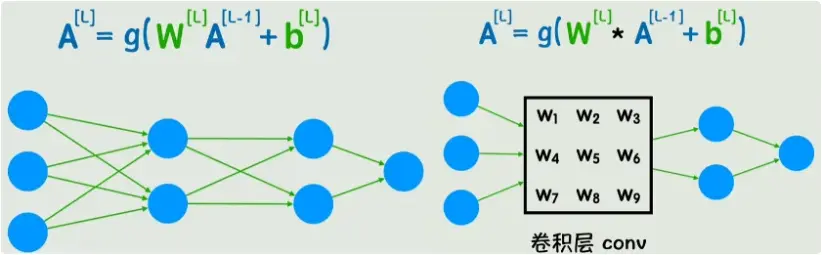

**池化层**：降维、保留主要特征、减少计算量。

典型结构：卷积层 → 池化层 → 全连接层（可多层叠加）

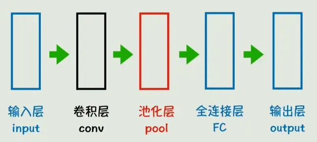

---

## 七、自然语言处理：词嵌入与 RNN

### 7.1 文字转数字

| 方法 | 缺点 |
|------|------|
| 数字映射 | 维度低，无法表示语义关系 |
| One-hot | 维度太高，稀疏，无语义关系 |
| **词嵌入** | ✅ 维度适中，向量表示语义相关性 |

### 7.2 词嵌入

词向量各位置为特征值（训练得到，语义未知），用**点积或余弦相似度**表示词语相关性。

有趣现象：桌子 - 椅子 ≈ 鼠标 - 键盘（语义关系数学化）

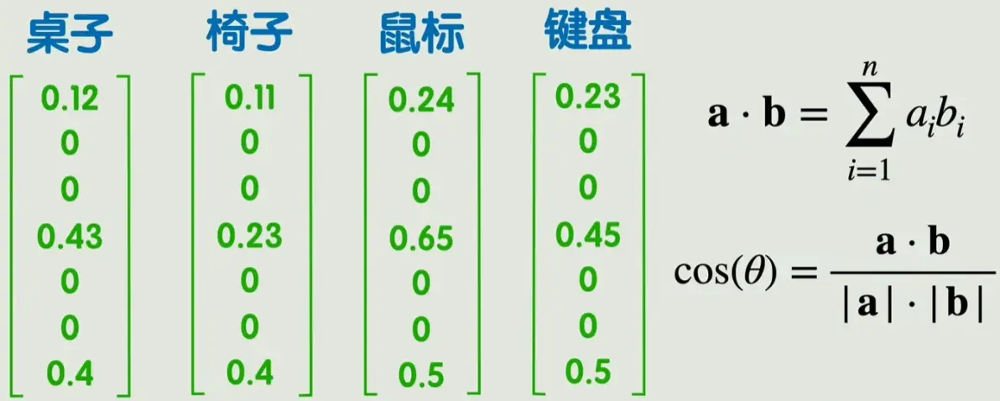

嵌入矩阵：所有词向量组成的大矩阵（经典训练方法：word2vec）

**潜空间**：词向量所在空间（维度超2-3维），可降维可视化。

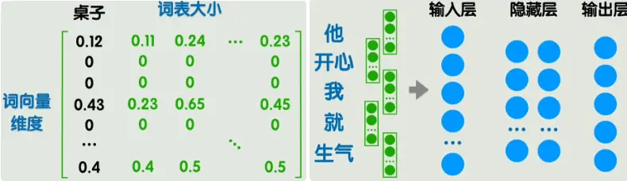

### 7.3 RNN 问题

直接输入一句话 → 输入层太大、长度不固定、无先后顺序信息。

逐词输入 → 第二词计算没包含第一词信息 → 引入**隐藏状态**传递信息 → **循环神经网络 RNN**

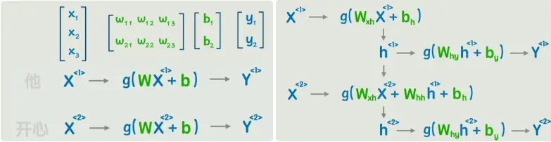

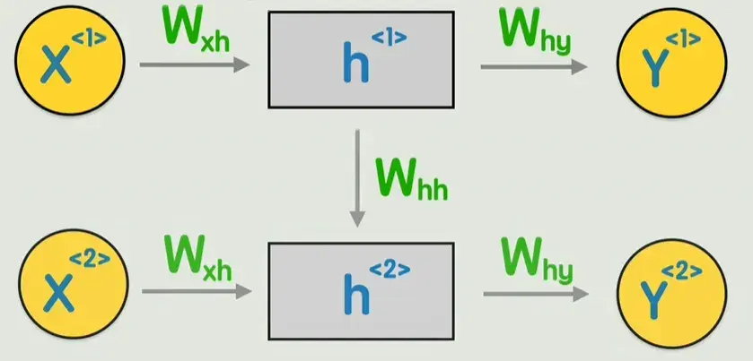

### 7.4 RNN 应用

- 判断句子褒贬词性
- 生成下一个字
- 机器翻译

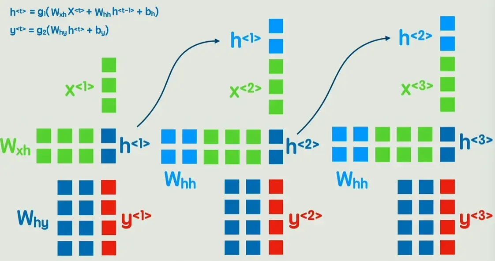

### 7.5 RNN 局限

| 问题 | 说明 |
|------|------|
| 长期依赖困难 | 信息随时间步丢失，远距离关键信息难以捕捉 |
| 顺序处理瓶颈 | 必须等待前一步计算完成 |

---

## 八、Transformer：彻底革新

### 8.1 位置编码

词向量 + 位置编码 → 每个词包含位置信息。

### 8.2 注意力机制

用 Wq、Wk、Wv 矩阵变换词向量 → 得到 Q、K、V

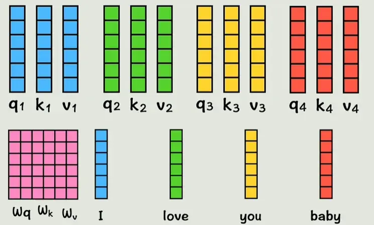

**核心计算**：
- Q·K 点积 → 词间相似度
- 相似度 × V → 加权求和
- 新词向量包含全部上下文信息

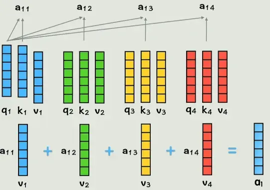

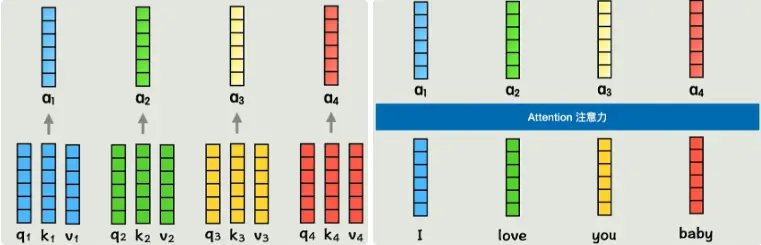

### 8.3 多头注意力

单一相关性计算灵活性低 → 多组 QKV → 多个「头」

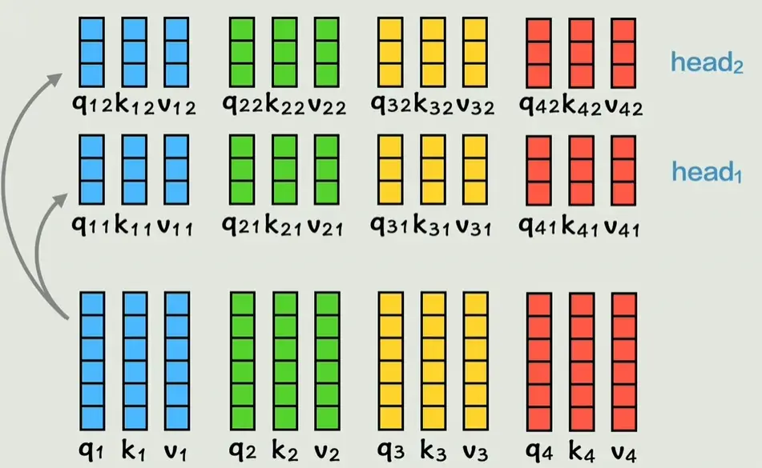

各头结果拼接 → 多头注意力输出

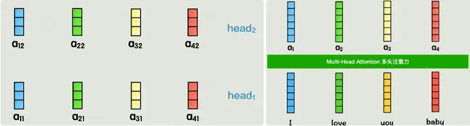

### 8.4 Transformer 结构

左侧**编码器**，右侧**解码器**

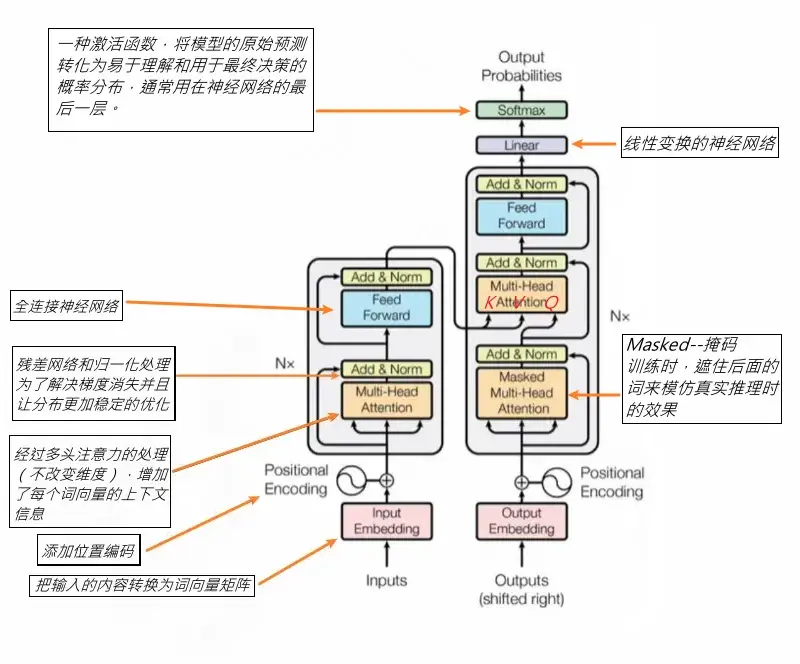

### 8.5 详细公式

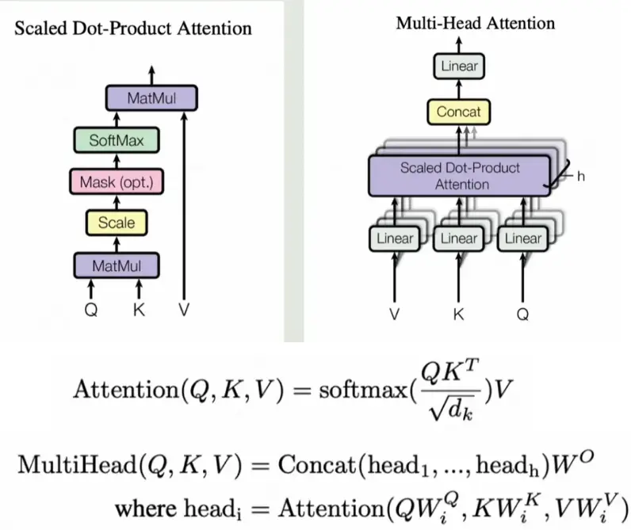

---

## 九、核心概念速查表

| 概念 | 定义 |
|------|------|
| 神经元 | 网络中的基本计算单元 |
| 前向传播 | 信号从输入向输出传播 |
| 反向传播 | 梯度从输出向输入传播 |
| 损失函数 | 预测误差的量化 |
| 梯度下降 | 沿梯度反方向优化参数 |
| 学习率 | 参数更新步长系数 |
| 过拟合 | 模型学习噪声导致泛化差 |
| 正则化 | 损失函数加惩罚项抑制过拟合 |
| Dropout | 随机丢弃神经元防止依赖 |
| CNN | 卷积神经网络，适合图像 |
| RNN | 循环神经网络，适合序列 |
| 词嵌入 | 词向量表示语义关系 |
| Transformer | 并行处理，注意力机制，彻底革新 NLP |

---

## 参考资料

- B站闪客神经网络视频合集