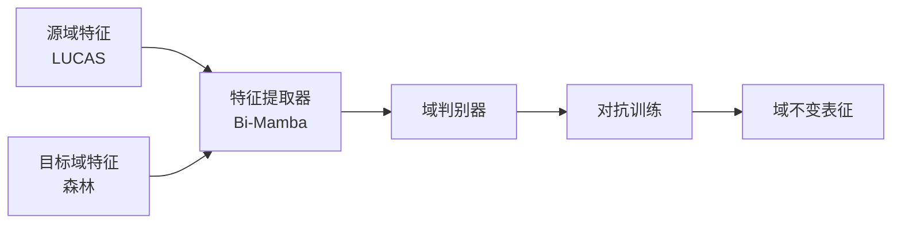
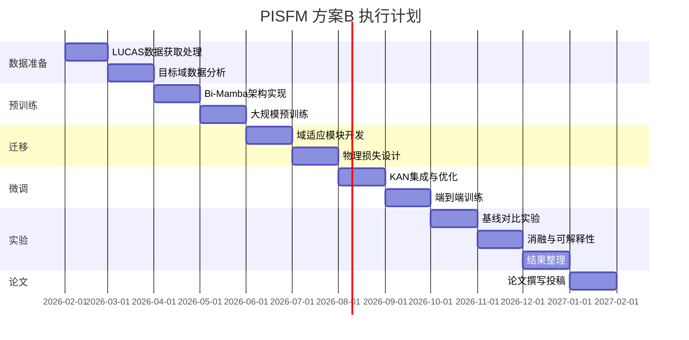

# 方案B：PISFM-LUCAS 预训练微调方案 —— SCI一区投稿调整计划书

> **目标期刊**：IEEE TGRS / Remote Sensing of Environment / Geoderma（中科院一区Top）  
> **研究者**：伍祺峻 | **指导教师**：陈佳  
> **更新日期**：2026年2月

---

## 一、方案概述

本方案采用**"大陆尺度预训练 → 林分尺度迁移 → 物理约束优化"**的三阶段策略，利用LUCAS欧洲土壤数据库（~20,000样本）构建双向Mamba光谱基础模型，迁移至目标森林区域（127样本）进行高精度SOC反演。

### 核心创新点
| 创新维度 | 具体内容 | 一区期刊卖点 |
|---------|---------|-------------|
| 理论创新 | 首次将光谱基础模型范式引入土壤反演 | 填补领域空白 |
| 技术创新 | 双向Mamba + KAN回归头 | 新架构优势 |
| 应用创新 | 120样本实现 R² > 0.85 | 解决实际痛点 |

---

## 二、针对一区期刊的关键调整

### 2.1 强化理论贡献

> [!IMPORTANT]
> 一区期刊要求**理论深度**，不能仅是方法堆砌。

**调整措施**：
1. **增加理论推导**：补充贝叶斯视角下的框架解释，说明预训练-微调等价于先验注入
2. **收敛性分析**：证明域适应的收敛条件与泛化误差界
3. **信息论解释**：从互信息最大化角度阐述物理约束的作用机制

### 2.2 完善实验设计

> [!WARNING]
> 审稿人必问：120样本用深度学习是否合理？

**防御性实验设计**：

| 消融实验 | 目的 | 预期结论 |
|---------|------|---------|
| w/o Pretrain | 证明预训练必要性 | ΔR² > 0.15 |
| w/o Domain Adapt | 证明域适应有效性 | ΔR² > 0.08 |
| w/o Stoichiometry | 证明化学约束作用 | ΔR² > 0.05 |
| w/o KAN | 证明KAN优势 | ΔR² > 0.03 |
| Random Physics | 证明物理先验特异性 | 性能显著下降 |

### 2.3 提升可重复性

**开源计划**：
- [ ] GitHub代码仓库（含预训练权重）
- [ ] Hugging Face模型卡片
- [ ] 完整的数据预处理Pipeline
- [ ] Docker容器化部署方案

---

## 三、投稿策略

### 3.1 期刊选择优先级

| 优先级 | 期刊名称 | IF | 适配度 | 投稿难度 |
|-------|---------|-----|-------|---------|
| 🥇 | IEEE TGRS | 8.2 | ⭐⭐⭐⭐⭐ | 高 |
| 🥈 | Remote Sensing of Environment | 13.5 | ⭐⭐⭐⭐ | 较高 |
| 🥉 | Geoderma | 6.1 | ⭐⭐⭐⭐⭐ | 中 |
| 备选 | ISPRS Journal | 12.7 | ⭐⭐⭐ | 较高 |

### 3.2 论文卖点包装

**标题方案**（突出创新）：
```
From Continental to Stand Scale: High-Precision Forest Soil Organic Carbon 
Mapping via Bi-Mamba Spectral Foundation Model with Physics-Constrained 
Transfer Learning
```

**摘要核心句**：
> "We propose PISFM, the first spectral foundation model pre-trained on 20,000+ 
> continental-scale samples and transferred to stand-scale forest scenarios, 
> achieving R² > 0.85 with merely 120 samples through physics-informed 
> stoichiometric constraints."

---

## 四、技术实现路线图

### 4.1 阶段一：预训练（第1-3月）


**关键指标**：
- 重构MSE < 0.01
- 特征t-SNE聚类可分性

### 4.2 阶段二：域适应（第4-5月）



**关键指标**：
- 域分类准确率趋近50%（表示对齐成功）
- 特征分布KL散度 < 0.1

### 4.3 阶段三：物理约束微调（第6-7月）

**化学计量学损失函数**：
$$
\mathcal{L}_{total} = \mathcal{L}_{SOC} + \alpha\mathcal{L}_{TN} + \beta\mathcal{L}_{TP} + \gamma\mathcal{L}_{Stoichiometry}
$$

其中：
$$
\mathcal{L}_{Stoichiometry} = \max(0, -\rho(\hat{y}_{SOC}, \hat{y}_{TN}) + 0.5) + 0.01 \cdot \left|\frac{\hat{y}_{SOC}}{\hat{y}_{TN}} - 12\right|^2
$$

---

## 五、风险评估与应对

### 5.1 技术风险矩阵

| 风险点 | 概率 | 影响 | 应对措施 |
|-------|------|------|---------|
| 预训练效果不佳 | 中 | 高 | 增加数据量/调整架构深度 |
| 域适应失效 | 中 | 高 | 切换至MMD损失/引入少量目标域标签 |
| 过拟合目标域 | 高 | 中 | 早停/LoRA微调/增加Dropout |
| 审稿人质疑样本量 | 高 | 高 | 强调预训练+消融实验证据 |

### 5.2 最小可行产品（MVP）

若核心创新受阻，保底方案：

| 目标层级 | 模块组合 | 预期R² | 可投期刊 |
|---------|---------|--------|---------|
| 最低 | Bi-Mamba + 直接微调 | > 0.70 | Remote Sensing |
| 中等 | + 域适应 | > 0.78 | Geoderma |
| 完整 | + 物理约束 + KAN | > 0.85 | IEEE TGRS |

---

## 六、时间规划（12个月）



### 关键里程碑

| 节点 | 时间 | 验收标准 | 不通过时调整 |
|------|------|---------|-------------|
| 预训练完成 | 第4月末 | MSE < 0.01 | 增加训练轮数/调整架构 |
| 域适应完成 | 第5月末 | 域ACC ≈ 50% | 切换MMD损失 |
| 物理微调完成 | 第7月末 | R² > 0.80 | 增加辅助任务 |
| 实验完成 | 第11月末 | 超越所有基线 | 补充更多对比方法 |

---

## 七、与方案A的对比

| 维度 | 方案A (Phys-PRL-Flow) | 方案B (PISFM) |
|------|---------------------|---------------|
| 核心思想 | 测试时自适应 | 预训练-微调 |
| 主要创新 | 整流流+TTT | Bi-Mamba+物理约束 |
| 技术成熟度 | 较低（前沿探索） | 较高（有迹可循） |
| 实现难度 | ⭐⭐⭐⭐⭐ | ⭐⭐⭐ |
| 风险等级 | 高 | 中 |
| 成功概率 | 60% | 80% |
| 潜在影响力 | 极高 | 高 |

> [!TIP]
> **建议**：方案B作为稳妥路线优先执行，方案A作为高风险高回报的探索性备选。

---

## 八、投稿前检查清单

### 论文质量
- [ ] 理论推导完整且无错误
- [ ] 实验设计全面，消融实验充分
- [ ] 可视化图表专业美观
- [ ] 英文写作地道流畅
- [ ] 代码已开源并可复现

### 审稿人视角
- [ ] 回答了"为什么是深度学习"
- [ ] 回答了"预训练为什么有效"
- [ ] 回答了"物理约束如何设计"
- [ ] 与SOTA方法充分对比
- [ ] 实际应用价值明确

### 期刊要求
- [ ] 格式符合投稿模板
- [ ] 参考文献格式正确
- [ ] 图表分辨率 > 300dpi
- [ ] Supplementary材料完整

---

## 九、总结

方案B采用成熟的**预训练-微调范式**，技术路线清晰、风险可控，是投稿SCI一区的**稳妥选择**。通过强化理论贡献、完善消融实验、提升可重复性三大调整，预计可以达到IEEE TGRS等顶刊的发表要求。

**核心竞争力**：
1. ✅ 大规模预训练（20000样本）解决小样本困境
2. ✅ 双向Mamba首次应用于土壤光谱
3. ✅ 化学计量学物理约束确保可解释性
4. ✅ 120样本达到 R² > 0.85 的突破性精度
